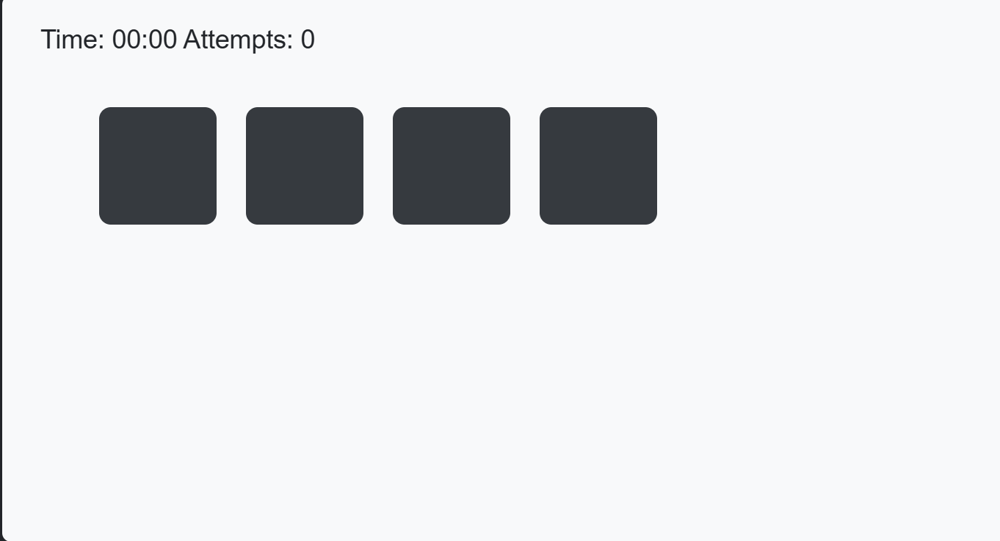

# Emoji Memory Match

**Date:** April 6, 2026

**Live Demo:** [Play the Game](https://ehassan256417-afk.github.io/emoji-memory-match/)

**Source Code:** [GitHub Repo](https://github.com/ehassan256417-afk/emoji-memory-match)

---

## Game Objective

Flip cards to find matching emoji pairs. Match all pairs with as few attempts as possible for the highest score!

## Rules

1. Enter your player name and select a difficulty (Easy / Medium / Hard).
2. Click **Play / Reset** to shuffle and deal the cards.
3. Click any card to flip it and reveal the emoji.
4. Click a second card. If both emojis match, they stay face-up!
5. If they do not match, both cards flip back after 1 second.
6. Match all pairs to win. Fewer attempts = higher score!
7. Your best score is saved automatically in localStorage.

## Wireframe



The wireframe shows the layout: navbar at top, settings form, score badges + progress bar, and the responsive card grid.

## Tech Stack

| Layer      | Technology                        |
|------------|-----------------------------------|
| Markup     | Semantic HTML5 + ARIA             |
| Styling    | Bootstrap 5.3 + Custom CSS        |
| Font       | Google Fonts: Nunito              |
| Scripting  | Vanilla JS (ES Modules)           |
| Storage    | localStorage (Web Storage API)    |
| Deployment | GitHub Pages (main branch root)   |

## Project Structure

```
/
index.html          # Main page (semantic HTML5, Bootstrap 5)
/scripts
  game.js           # Main game module (ES Module)
  storage.js        # LocalStorage helpers (ES Module)
/styles
  game.css          # Custom CSS (variables, grid, flip animations)
/images
  wireframe.png     # Hand-drawn wireframe
README.md
```

## Bootstrap 5 Components Used

- **Navbar** - responsive top navigation with hamburger menu (data-attribute initialized)
- **Modal** - "How to Play" instructions and "You Won!" win screen
- **Progress Bar** - shows completion percentage as pairs are matched
- **Badges** - live score, attempts, timer, and best score displays
- **Card** - wraps the settings form

## Code Snippet Explained

The core shuffle uses the **Fisher-Yates algorithm**, which is statistically unbiased:

```javascript
// Fisher-Yates shuffle: O(n) time, every permutation equally likely
function shuffle(array) {
  const arr = [...array]; // copy to avoid mutating EMOJI_POOL
  for (let i = arr.length - 1; i > 0; i--) {
    const j = Math.floor(Math.random() * (i + 1));
    [arr[i], arr[j]] = [arr[j], arr[i]];
  }
  return arr;
}
```

Called each round: `shuffle(EMOJI_POOL).slice(0, pairs)` picks N random emojis,
then `shuffle([...selected, ...selected])` creates a paired deck. Every game has a fresh layout.

## Storage

- **localStorage** keys: `emj_playerName`, `emj_difficulty`, `emj_theme`, `emj_bestScore`
- Data is read on page load to pre-populate the settings form
- Module exports: `saveSettings`, `loadSettings`, `saveBestScore`, `loadBestScore`

## Easter Egg

Open the browser console and type `unlockSecret()` to toggle a rainbow animation!

## Accessibility

- Cards have `role="button"`, `aria-label`, `aria-pressed` states
- Live regions: `aria-live="polite"` on score, attempts, timer
- Keyboard navigation: Tab to focus, Enter/Space to flip
- Focus-visible outline for keyboard-only users
- WCAG AA color contrast throughout

## Resources

- [Bootstrap 5 Docs](https://getbootstrap.com/docs/5.3/)
- [MDN CSS Grid](https://developer.mozilla.org/en-US/docs/Web/CSS/CSS_grid_layout)
- [Google Fonts Nunito](https://fonts.google.com/specimen/Nunito)
- [Fisher-Yates Shuffle](https://en.wikipedia.org/wiki/Fisher%E2%80%93Yates_shuffle)
- [WebAIM Contrast Checker](https://webaim.org/resources/contrastchecker/)

## Validation Links

- [Nu Validator](https://validator.w3.org/nu/?doc=https%3A%2F%2Fehassan256417-afk.github.io%2Femoji-memory-match%2F)
- [WAVE Accessibility](https://wave.webaim.org/report#/https://ehassan256417-afk.github.io/emoji-memory-match/)
